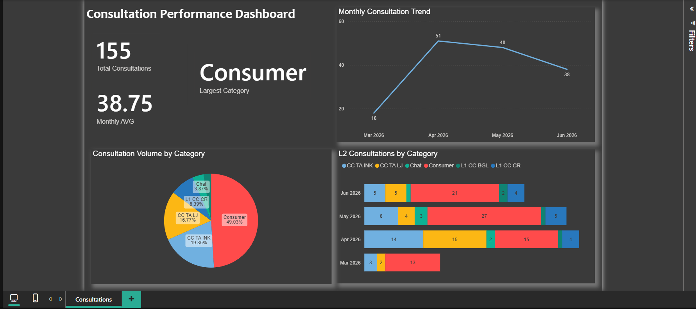

# Consultation-Performance-Dashboard
Power BI dashboard analyzing consultations trends

## 📸 Dashboard Preview
 

# Power BI Dashboard - Consultations Analysis

## 📊 Overview
This project presents a Power BI dashboard designed to analyze consultation trends over time.

## 🔍 Key Insights
- Average consultations per month
- Trend analysis by period
- Peak activity identification

## 🛠 Tools Used
- Power BI
- Excel (data source)

## 📁 Files
- .pbix file: main dashboard

## 🚀 How to Use
1. Download the .pbix file
2. Open it in Power BI Desktop

3. 

